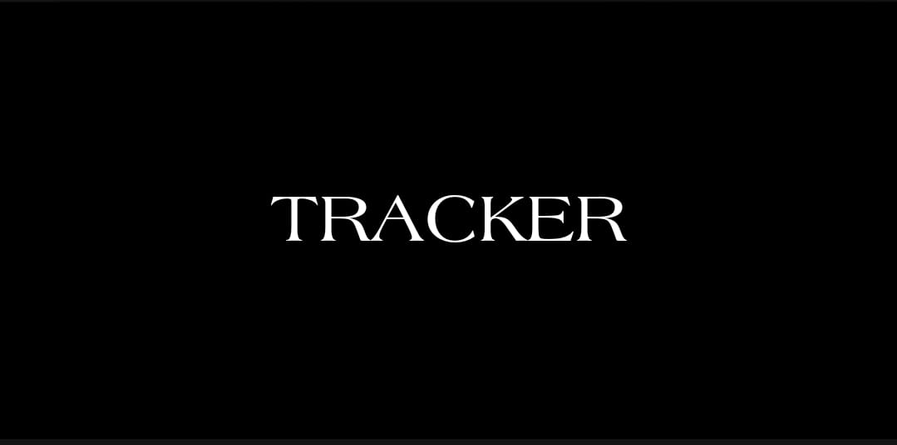

# Tracker

<p align="center">

<br/>
Tracker is a simple location logger app using Core Location and Realm frameworks.
<br/>
Written in Swift and MVVM architecture.
</p>

<p align="center">
    <a href="https://github.com/loay-ashraf/Tracker/actions/workflows/iosCI.yml">
        
    </a>
    <a href="https://en.wikipedia.org/wiki/Model–view–viewmodel">
        
    </a>
    
    
</p>


|         | Features  |
----------|-----------------
:round_pushpin: | View current location on map
:spiral_notepad: | Track, review and share visited locations
:tada: | New User onboarding
:fire: | Lottie animations
:octocat: | 100% Open source

## Installation

### Clone the Repository :arrow_double_down:

```sh
git clone https://github.com/loay-ashraf/Tracker
```

### Install Required pods :package:

```sh
cd Tracker
pod install
```

### (Optionally) Install Rugby for speedy Xcode builds :zap:

visit [Rugby](https://github.com/swiftyfinch/Rugby) for installation instructions.

## References

### Third Party Libraries
* [RealmSwift](https://github.com/realm/realm-swift)
* [NotificationBannerSwift](https://github.com/Daltron/NotificationBanner)
* [lottie-ios](https://github.com/airbnb/lottie-ios)

### Tools
* Xcode 13.2
* iPhone 12 Simulator (iOS 14.5)

